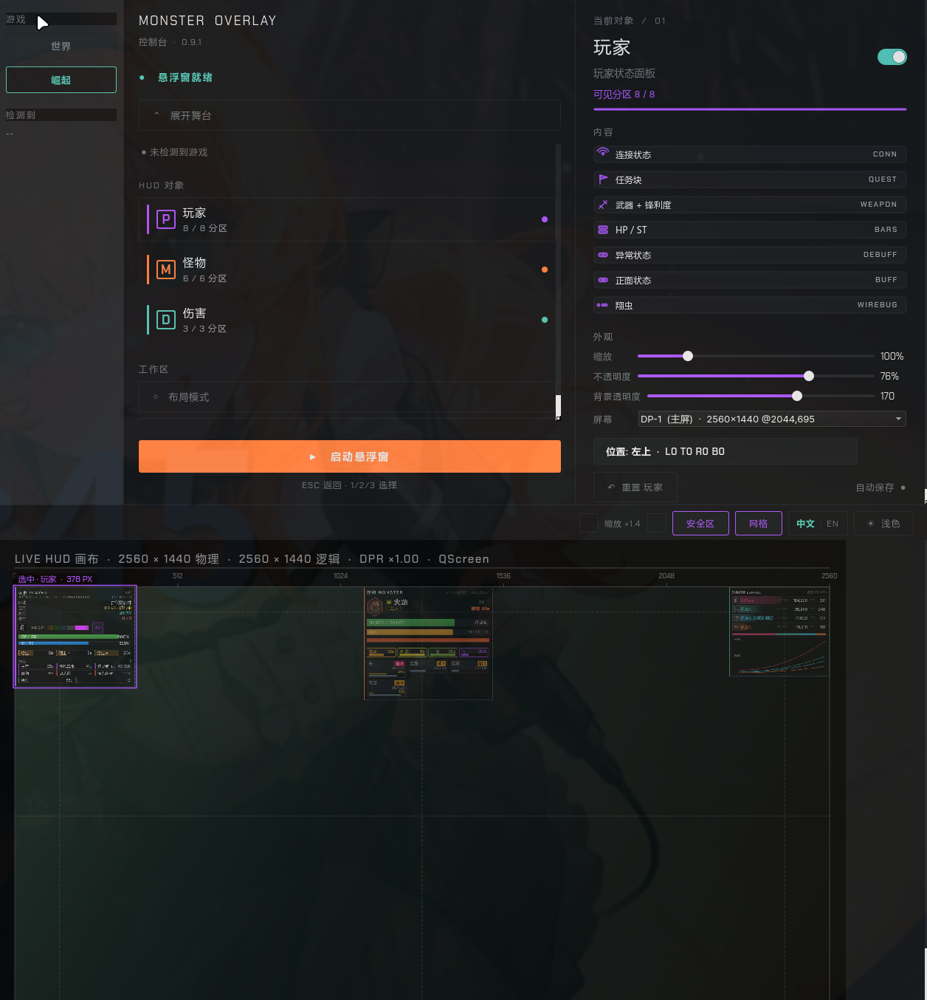
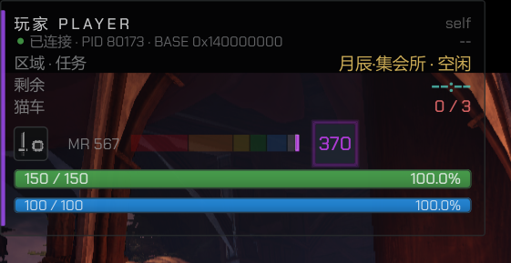
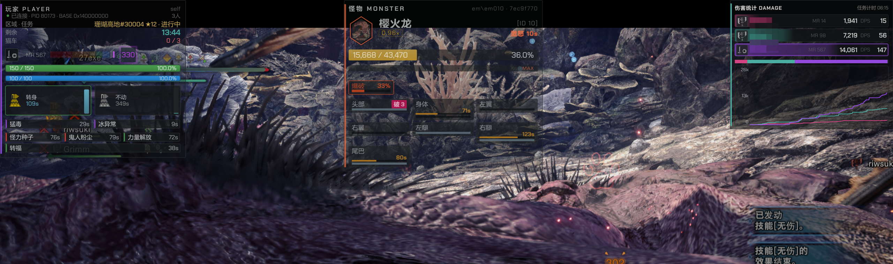
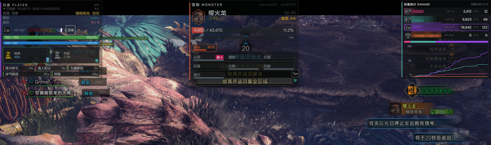

# MHW Linux Overlay

A native-Linux HUD overlay for the **Monster Hunter** series running
under Steam + GE-Proton. Reads the game's process memory directly via
`/proc/<pid>/mem` and renders a Qt 6 HUD on Wayland through
`zwlr_layer_shell_v1`.

This is a **Linux port of [HunterPie v2](https://github.com/HunterPie/HunterPie)**
— we do *not* inject a DLL into the game. The overlay is a separate
process that attaches to the running MHW process and reads what it
needs to render.

**Current stable:** `v0.7.5` (commit `ac60017`).

### Environment support

The overlay was developed and primary-tested on **KDE Plasma 6 Wayland**;
it is now in daily use on the maintainer's machine running **Niri**,
and the screenshots in this README are captured there. Compositors
implementing `zwlr_layer_shell_v1` are expected to work:

| Compositor | Status | Notes |
|------------|:------:|-------|
| **KDE Plasma 6 Wayland** | ✅ Works | Where the overlay was originally developed. |
| **Niri** | ✅ Works (screenshot rig) | Confirmed running perfectly — every panel + console + drag preview works identically here. |
| **Hyprland / Sway / river / Wayfire** | ✅ Should work | All four implement `zwlr_layer_shell_v1`; not regularly tested, please report. |
| **GNOME (X11 or Wayland)** | ❌ Not supported | GNOME ships no `zwlr_layer_shell_v1`. The overlay would fall back to an un-anchored window. |
| **Plain X11 (no compositor)** | ❌ Out of scope | Layer-shell is the only positioning mechanism we use. |

GPU is **driver-agnostic** — Qt 6 picks `egl` / `wayland-client` automatically;
NVIDIA + Wayland uses the system `libEGL.so`. No Vulkan or DRI requirements.

[中文文档 — 简体中文](README.zh-CN.md)

---

## What it shows

There are three independent panels, anchored to screen corners via
`zwlr_layer_shell_v1`. The grid below shows exactly what each one does
in each game state — this is observed behavior, not aspirational:

| Panel | Out of quest (hub) | In quest | Quest-end transition |
|-------|:------------------:|:--------:|:---------------------:|
| **Player** — HP / ST bars, weapon icon + sharpness, mantle names + CD countdowns, party slot count, debuff / blight timers, MR rank, quest slot / zone / timer | ✅ full | ✅ full | ✅ full (frozen) |
| **Monster** — total HP + percentage, per-part HP bars, ailment timers, enrage / sleep countdown, Ail/Part severable+flinch logic per HunterPie | hidden (no live monster) | ✅ full | ✅ **stays on** — the residual HP may be non-zero if the host is mid-transition (capture / reward settlement). Normal behaviour, not a bug. |
| **Damage** — party list, per-row percent bars, DPS / hit ranking, time-series chart | hidden | ✅ live rolling | ✅ **frozen at the final quest state**, **full party roster preserved** (including the slot where a player dropped off mid-quest — `dropOut` is sticky by design) |

### Screenshots

| State | Screenshot | What you'll see |
|-------|------------|-----------------|
| **Control console** |  | `monster-control` GUI: game selector (`WORLD` / `RISE`), HUD-object list, per-section toggles, zoom controls, and the live HUD canvas preview at the bottom. |
| **Out of quest (hub / Seliana)** |  | Only the **Player** panel — no live monster and no live quest damage, so the other two are intentionally blank / hidden. HP / ST / MR / sharpness / cat-cars still rendered. |
| **In quest** |  | All three panels active on a Coral Palace ★12 hunt against an Apex Rathalos. Live monster HP 4 855 / 43 470, per-part HP, Apex icon and enrage; damage ranking for the **3 hunters active at the snapshot moment** (a 4th joined a moment after capture). |
| **Quest end (capture / transition)** |  | The 「発見調査班報告 / Investigation Complete」 banner with a 20-second return countdown. **All three panels stay on** here — the player panel, the **Monster** panel (still showing the post-defeat HP — *which is non-zero by design because the host hasn't zero'd the monster struct yet, e.g. capture or partial reward*), and the full **Damage** panel with the final party roster. |

> All HUD text is driven by `src/resources/i18n/<locale>.json`. See
> [`docs/I18N.md`](docs/I18N.md). The shipping locale today is `zh-CN`;
> `en-US`/`ja-JP` slots are wired in but not yet populated.

---

## Game support matrix

| Game | Status | Memory map | Notes |
|------|:------:|------------|-------|
| **Monster Hunter: World** | ✅ Stable | `data/MonsterHunterWorld.421810.map` (Steam build 421810) | Full feature set, v0.7.5 in daily use. |
| **Monster Hunter: Rise** | ⚠️ Adapted, **not tested** | `data/MonsterHunterRise.16.0.2.0.map` | Offsets ported from HunterPie v2; structurally verified against the binary but no live-game run by the maintainer. Expect schema drift if Capcom shifted struct layouts since HunterPie 2.14.0.461. |
| **Monster Hunter: Wilds** | ⏳ Parked (waiting on Capcom) | — | Wilds is unplayable on Linux in its current state, so the maintainer is holding off until Capcom ships a stable build worth buying. HunterPie v2 already publishes Wilds offsets (e.g. `MonsterHunterWilds.1.1.1.0.map`), and the port would be mechanical — drop the map into `data/` + a few wire-up lines in the reader. So the bottleneck isn't engineering; it's the upstream Linux / Proton story. |

Selecting `RISE` in the console today will load the map, but the
reader will most likely produce empty snapshots until the offsets are
re-validated against a live session.

---

## Quick start (end user)

Download the release tarball, extract it, and run two commands — no
build step, no system install needed.

```bash
# 1. extract
tar -xzf monster-overlay-v0.7.5-linux-x86_64.tar.gz
cd monster-overlay-v0.7.5

# 2. install runtime dependencies (Arch Linux)
sudo pacman -S --needed qt6-base qt6-declarative qt6-wayland layer-shell-qt

# 3. launch Steam with Monster Hunter: World and start a quest,
#    then run the control console:
./monster-control
```

In the console:

1. Pick `WORLD` (or `RISE` if you have validated it for your build).
2. Toggle the sections you want on each panel.
3. Click **START OVERLAY**. The console window hides and the overlay
   spawns on top of the game.
4. Quit the game (or press `Esc` over the overlay) — the console
   re-appears.

To install the binaries system-wide instead of running in place:

```bash
./install.sh                 # copies to ~/.local/bin/
sudo setcap cap_sys_ptrace+ep ~/.local/bin/monster-overlay   # optional
```

### Permissions: reading `/proc/<pid>/mem`

`/proc/<pid>/mem` reads from a non-child process are blocked by
default. Pick **one**:

```bash
# option A — temporary (until next reboot)
sudo sysctl kernel.yama.ptrace_scope=0

# option B — permanent, scoped to the binary
sudo setcap cap_sys_ptrace+ep ./monster-overlay
```

`install.sh` does **not** set capabilities on its own. See
[`docs/ARCHITECTURE.md`](docs/ARCHITECTURE.md) for the full write-up.

### Requirements

- **Steam + GE-Proton 10-34** (or Proton 9+)
- **Any Wayland compositor** implementing `zwlr_layer_shell_v1` — KDE Plasma 6
  (default test rig), Niri (current daily-use), Hyprland, Sway, river, Wayfire
  have all been confirmed or are trivially expected to work. See the matrix above.
- A running `MonsterHunterWorld.exe` (or Rise) process for live mode
- Qt 6.8+ runtime libraries (`qt6-base`, `qt6-declarative`, `qt6-wayland`,
  `layer-shell-qt` on Arch)

For the **complete walkthrough of every interaction** — the HUD-canvas
drag in the control console, arrow-key nudging + Shift modifiers, Ctrl-S
persist, Space minimize, Esc graceful-quit, per-section bitmask math, and
the split behaviour of the per-section `--mask-*` versus whole-panel
`--no-*` flags — see [`docs/USAGE.md`](docs/USAGE.md).

---

## Quick start (developer)

```bash
git clone https://github.com/27-exe/monster-overlay
cd monster-overlay

# build
cmake -B build -G Ninja
cmake --build build -j$(nproc)

# run against a live MHW (the .map ships in data/)
./build/monster-overlay --map data/MonsterHunterWorld.421810.map

# run in edit mode (no game needed; position panels with the keyboard)
./build/monster-overlay --edit --poll 250
#   click a panel to focus it, then:
#     ←↑↓→   nudge 10 px  |  Shift + ←↑↓→   nudge 50 px
#     wheel               zoom 0.5× – 2×
#     Ctrl + S            persist position to ~/.config/monster-overlay/panels.ini
#     Space               toggle minimized (small letter block)
#     Esc                 graceful quit

# control console (replaces the command-line toggles)
./build/monster-control

# tests
ctest --test-dir build --output-on-failure
```

Build dependencies on Arch:

```bash
sudo pacman -S qt6-base qt6-declarative qt6-wayland layer-shell-qt cmake ninja
```

`MonsterHunterWorld.421810.map` is resolved automatically from
`MHW_DEFAULT_MAP` (set by CMake) if `--map` is omitted.

---

## CLI flags

| Flag | Meaning |
|------|---------|
| `-m, --map <path>` | HunterPie legacy map file (default: bundled) |
| `--locale <code>`  | UI locale, default `zh-CN` (currently the only shipped locale) |
| `--edit`           | Edit mode — no game required, demo data on the panels |
| `--poll <ms>`      | Polling interval, default 250, range 30–5000 |
| `--mask-player <hex32>`  | per-section mask for the player panel (default `0xFFFFFFFF` = all on) |
| `--mask-monster <hex32>` | per-section mask for the monster panel |
| `--mask-damage <hex32>`  | per-section mask for the damage panel |
| `--no-player` / `--no-monster` / `--no-damage` | hide the whole panel |
| `-h, --help` / `-v, --version` | self-explanatory |

Per-section bit layouts live in `src/ui/panel_sections.h`.

---

## Repo layout

```text
src/
├── main.cpp                  # monster-overlay entry
├── main_control.cpp          # monster-control entry
├── mhw_reader.{h,cpp}        # orchestrator over the per-domain readers
├── core/                     # StringTable + shared utilities
├── ui/                       # Player / Monster / Damage panels + control console
├── memory/                   # /proc/<pid>/mem helpers + HunterPie map loader
├── resources/i18n/           # UI strings (currently zh-CN)
├── resources/monsters/       # ailments.json, parts.json (HunterPie-derived)
└── tests/                    # schema integrity, mask round-trip, etc.

data/
├── MonsterHunterWorld.421810.map   # Steam MH:W build offsets
└── MonsterHunterRise.16.0.2.0.map  # MHRise offsets (untested)

assets/
├── icons/                    # MHW-derived SVG icons (OthelloRhin MIT + HunterPie Apache-2.0)
├── fonts/                    # WorkSans (OFL-1.1)
├── charts/alligator_noise_512x512.jpg   # chart-grain texture (HunterPie Apache-2.0)
├── NOTICE                    # third-party attribution
└── screenshots/              # README + docs image assets

docs/
├── ARCHITECTURE.md           # reader layering, why-proc-mem-not-injection, ptrace_scope
├── ASSETS.md                 # how icons/charts/fonts are loaded, how to add more
├── CONTROL_CONSOLE.md        # monster-control architecture + state flow
├── I18N.md                   # adding a locale, adding a UI string
├── USAGE.md                  # full interaction walkthrough (drag, arrow-keys, masks)
└── PROBE-TOOLS.md            # what each monster-probe-* does (developer-only)
```

---

## How it works (one paragraph)

The overlay is a Qt 6 Wayland client. It opens three layer-shell
surfaces, one per panel, each anchored to a screen corner. A reader
thread attaches to `MonsterHunterWorld.exe` by PID, opens
`/proc/<pid>/mem`, follows a HunterPie-v2 pointer chain into the
player / monster / damage structs, and copies the relevant fields
into a typed snapshot every `--poll` ms. The UI thread takes the
snapshot, runs i18n substitution, and re-renders with QPainter into
the layer-shell surfaces.

There is **no DLL injection, no in-process hooks, no asset extraction
at runtime** — we read strings from process memory as data, never as
files.

Full architecture notes: [`docs/ARCHITECTURE.md`](docs/ARCHITECTURE.md).

---

## Credits

This project stands on the shoulders of:

- **[HunterPie v2](https://github.com/HunterPie/HunterPie)** (C#,
  Apache-2.0) — the reference implementation. We re-implemented its
  memory-reader logic in C++ and validated every field offset against
  `HunterPie-v2/Core/*.cs` before shipping. Original offsets are
  credited inline in `mhw_reader.cpp`.
- **[MHW_Icons_SVG](https://github.com/OthelloRhin/MHW_Icons_SVG)**
  (MIT) — path data for status/ailment icons was adapted from
  HunterPie's XAML resources; the SVG icons in `assets/icons/` come
  from this project.
- **[WorkSans](https://github.com/weiweihuanghuang/Work-Sans)**
  (OFL-1.1) — HUD typography.

We **do not** extract anything from the MHW binary at runtime and we
**do not** ship any Capcom-owned assets. See
[`assets/NOTICE`](assets/NOTICE) for the full third-party
attribution and `LICENSES/HunterPie-APACHE-2.0.txt` for the license
text we ship.

---

## Contributing

- **Bug reports** — please include
  `~/.config/monster-overlay/monster-overlay.conf`, the reader snapshot
  (`~/.cache/monster-overlay/`), and the game build ID (in-game:
  `Options → Game Options → Game Version`).
- **Rise validation** — if you own MHRise and can run the overlay
  against it, the offsets ported from HunterPie 2.14.0.461 need a
  fresh diff against a live session before the `RISE` button is
  honest.
- **Wilds offsets** — depends on HunterPie publishing them first.
  Until then, this project has no Wilds support.

---

## License

Apache-2.0. See [`LICENSE-APACHE-2.0.txt`](LICENSE-APACHE-2.0.txt)
(the HunterPie license we mirror). The Linux port glue written for
this project is *also* Apache-2.0.

---

## See also (developer docs)

- [`docs/ARCHITECTURE.md`](docs/ARCHITECTURE.md) — reader layering, the `tr()`
  ADL trap, Yama `ptrace_scope` caveat, why we keep coordinates as logical px.
- [`docs/CONTROL_CONSOLE.md`](docs/CONTROL_CONSOLE.md) — `monster-control`
  architecture and state flow.
- [`docs/USAGE.md`](docs/USAGE.md) — full interaction walkthrough (preview
  drag, arrow-key nudge + Shift, Ctrl-S persist, Space minimise, Esc quit,
  per-section bitmask math, `--mask-*` vs `--no-*`).
- [`docs/I18N.md`](docs/I18N.md) — adding a UI string, adding a locale.
- [`docs/PROBE-TOOLS.md`](docs/PROBE-TOOLS.md) — what each `monster-probe-*`
  binary does and when to use which.
- [`docs/ASSETS.md`](docs/ASSETS.md) — icon/chart/font pipeline and
  attribution discipline.
