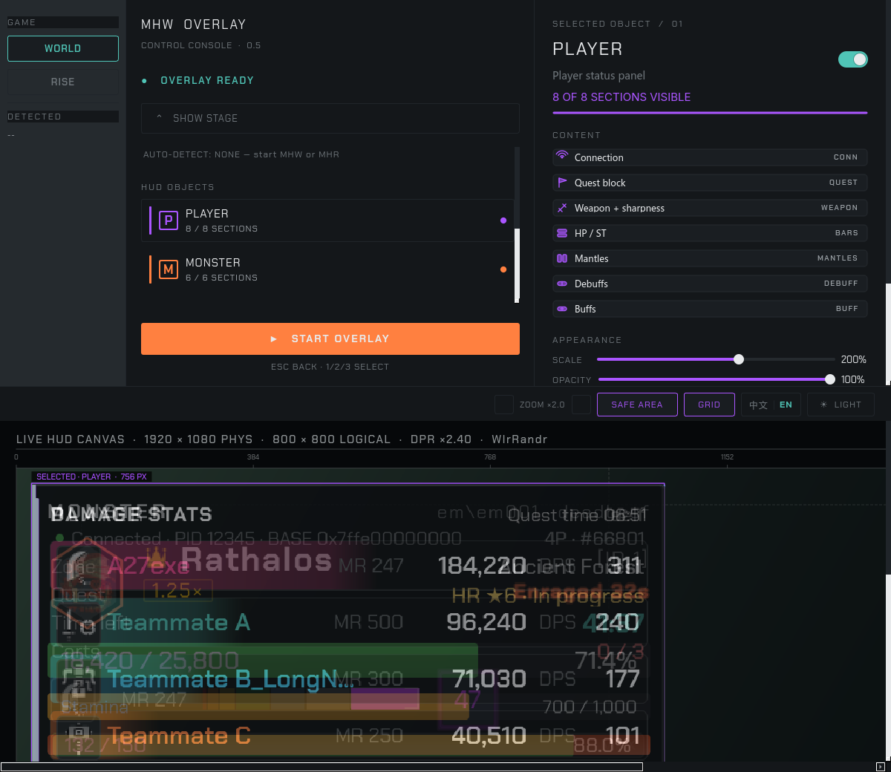

# Monster Overlay(中文说明)

一个原生 Linux 的 **怪物猎人** 系列悬浮窗 / DPS 面板工具,运行在
Steam + GE-Proton 之上。它通过 `/proc/<pid>/mem` 直接读取游戏进程
内存,并在 Wayland 上通过 `zwlr_layer_shell_v1` 渲染 Qt 6 HUD。

这是 **[HunterPie v2](https://github.com/HunterPie/HunterPie) 的 Linux 移植版本**。
本工程**不注入 DLL** —— overlay 是独立的进程,附加到你正在运行的
MHW 上,通过读进程内存画出 HUD。

**最新稳定版:** `main` 分支(最近发布 tag:`v0.9.1`)。

[English documentation](README.md)

---

### 运行环境支持

overlay 起初在 **KDE Plasma 6 Wayland** 上开发并完成主要测试;
现已在维护者的 **Niri** 机器上日常使用,本文档的 4 张截图都是从
Niri 抓的。实现了 `zwlr_layer_v1` 协议(`zwlr_layer_shell_v1`)
的 compositor 都可以运行:

| Compositor | 状态 | 说明 |
|------------|:----:|------|
| **KDE Plasma 6 Wayland** | ✅ 可用 | 工程最初开发的目标环境。 |
| **Niri** | ✅ 可用(本 README 截图来源) | 维护者当前日常使用的环境;实测每个 panel + 控制台 + 拖拽预览都完美运行。 |
| **Hyprland / Sway / river / Wayfire** | ✅ 应当可用 | 都实现了 `zwlr_layer_shell_v1`,未系统测试,欢迎报告。 |
| **GNOME(X11 或 Wayland)** | ❌ 不支持 | GNOME 不带 `zwlr_layer_shell_v1`,overlay 会回退成一个无法锚定的普通窗口。 |
| **裸 X11(无 compositor)** | ❌ 不在范围内 | layer-shell 是我们唯一的定位机制。 |

GPU **driver 无要求** —— Qt 6 自动选择 `egl` / `wayland-client`
backend;NVIDIA + Wayland 走系统的 `libEGL.so`,不需要 Vulkan、不
需要 DRI。

---

## 它显示什么

三块 panel 通过 `zwlr_layer_shell_v1` 独立锚定到屏幕四角。下表是
**观察到的真实行为**,不是承诺:

| Panel | 任务外(据点) | 任务中 | 任务结算转场 |
|-------|:----------:|:------:|:-----------:|
| **Player** —— HP / ST 条、武器图标 + 锋利度、衣装名 + CD 倒计时、队伍人数、状态 / 减益计时器、MR 等级、任务槽 / 区域 / 倒计时 | ✅ 完整 | ✅ 完整 | ✅ 完整(冻结) |
| **Monster** —— 总 HP + 百分比、各部位 HP 条、异常状态计时、激怒 / 睡眠倒计时、Ail/Part 分类按 HunterPie 的 Severable+Flinch+Breakable 三分支派发 | 隐藏(没有活的怪) | ✅ 完整 | ✅ **保持显示** —— 任务结算瞬间残留 HP 可能非零(捕获 / 奖励结算),这是正常行为,不是 bug |
| **Damage** —— 队伍列表、每行贡献比例条、DPS / Hit 排行、随时间变化的曲线 | 隐藏 | ✅ 实时滚动 | ✅ **冻结在最终任务状态,完整队伍名单保留**(包括中途退出的那个 slot —— `dropOut` 按设计是粘性的) |

### 截图

| 状态 | 截图 | 描述 |
|------|------|------|
| **控制台** |  | `monster-control` GUI:游戏选择(WORLD / RISE)、HUD object 列表、每个 section 的开关、缩放控制、底部实时 HUD canvas 预览。 |
| **任务外(据点 / 月辰集会所)** |  | 只有 **Player** panel —— 没有活的怪物、没有可计算的伤害,另两块故意不渲染。HP / ST / MR / 锋利度 / 猫车照样显示。 |
| **任务中** |  | 三块全部就位 —— 珊瑚高地 ★12,狩猎 Apex 火龙。怪物 HP 4 855 / 43 470、部位 HP、Apex 图标、激怒;**截图瞬间是 3 个在场的猎人**(第 4 个在截图后才进队)。 |
| **任务结束(捕获 / 转场)** |  | 「発見調査班報告 / Investigation Complete」banner,20 秒后返回据点倒计时。**三块 panel 全部保持显示** —— Player panel、Monster panel(显示任务结算时的 HP —— 因为主机端还没把怪物 struct 清零,比如捕获 / 奖励结算等场景,残留 HP 是正常行为)、完整的 Damage panel(含最终队伍名单)。 |

### 语言(EN / 中文)

界面**内置简体中文与英文**,支持**运行时切换** —— 不需要重启:

- 点控制台顶栏的 **`中文 | EN`** chip:控制台立即切换,悬浮窗约 1 秒
  内跟随(控制台把 `locale=` 写进
  `~/.config/monster-overlay/monster-overlay.conf`,悬浮窗轮询该文件 ——
  无 IPC、无重启、无闪断)。
- 切换覆盖**全部界面**:面板文案、状态/连接行,以及游戏**数据名** ——
  怪物名、部位名、区域名、异常状态(含玩家增益/减益)—— World 与
  Rise 都支持。
- **首次运行跟随桌面语言**:没有任何已保存的选择时,界面默认英文;
  系统 locale 为 `zh*` 时用中文(依次看 `LC_ALL` / `LC_MESSAGES` /
  `LANG`,最后看 `LANGUAGE`;`C`/`POSIX`/未设置 → 英文)。
- 启动优先级:`--locale <code>` → conf 里的存档值 → 检测到的系统语言。
  存档值**只**由显式选择写入(chip,或控制台自己的 `--locale`),因此
  从未手动选过的机器会一直跟随桌面,而不会被"钉"在某个默认值上。



英文数据名取自 HunterPie 官方 `en-us.xml`;中文一侧保持 i18n 之前的
冻结值。再生成脚本(`scripts/gen_schema.py`、
`scripts/extract_rise_monster_names.py`、
`scripts/generate_rise_part_names.py`、
`scripts/extract_rise_abnormalities.py`)与键位核对
(`scripts/i18n_key_parity.py`、`scripts/i18n_check_tr_keys.py`)
保证两侧不漂移 —— 完整说明见 [`docs/I18N.md`](docs/I18N.md)。

---

## 游戏支持矩阵

| 游戏 | 状态 | 内存地图 | 说明 |
|------|:----:|---------|------|
| **Monster Hunter: World**(Steam ID 582010) | ✅ 稳定 | `data/MonsterHunterWorld.421810.map`(Steam build 421810) | 全部功能上线,维护者日常使用中。 |
| **Monster Hunter: Rise**(Steam ID 1446780) | ✅ 支持 | `data/MonsterHunterRise.16.0.2.0.map` | Player / Monster 面板已实机验证(16.0.2.0)。**伤害面板暂不支持:崛起的伤害追踪没有原生实现**,伤害统计目前仅限世界。 |
| **Monster Hunter: Wilds** | ⏳ 暂缓(未购买) | — | 荒野目前看起来还不是一款好游戏,维护者没打算购买 —— 没有游戏也就无从适配。若将来(比如 DLC 发售之后)改变主意入手,适配自然也会跟上:HunterPie v2 已经在放出 Wilds offsets(比如 `MonsterHunterWilds.1.1.1.0.map`),到时只需把 .map 拷进 `data/`、reader 里加几行 wire-up。 |

控制台里直接选 `RISE` 即可 —— Player / Monster 面板与 World 表现一致;
**伤害面板在 Rise 上按设计关闭**(暂无原生伤害数据源)。

---

## 快速开始(普通用户)

下载 release tarball,解包,执行两条命令 —— 不需要编译也不需要
系统级安装。

```bash
# 1. 解包
tar -xzf monster-overlay-v0.9.1-linux-x86_64.tar.gz
cd monster-overlay-v0.9.1

# 2. 安装运行时依赖(Arch Linux)
sudo pacman -S --needed qt6-base qt6-declarative qt6-wayland layer-shell-qt

# 3. 启动 Steam 装上怪猎世界,进入任务后,跑控制台:
./monster-control
```

在控制台里:

1. 选 `WORLD` 或 `RISE`(两边均完整支持;伤害追踪仅限世界)。
2. 切换每块 panel 下你想要的 section。
3. 点 **START OVERLAY**。控制台窗口隐藏,overlay 进程在游戏上方弹出。
4. 退出游戏(或在 overlay 上按 `Esc`)—— 控制台重新出现。

如果想真把 binary 安到系统路径下:

```bash
./install.sh                 # 拷到 ~/.local/bin/
sudo setcap cap_sys_ptrace+ep ~/.local/bin/monster-overlay   # 可选
```

### 权限:读 `/proc/<pid>/mem`

默认情况下,读非子进程的 `/proc/<pid>/mem` 是被阻断的。挑一个:

```bash
# 选项 A —— 临时(重启后失效)
sudo sysctl kernel.yama.ptrace_scope=0

# 选项 B —— 永久,且仅作用在那个二进制上
sudo setcap cap_sys_ptrace+ep ./monster-overlay
```

`install.sh` **不会**自动设 capability。详细说明见
[`docs/ARCHITECTURE.md`](docs/ARCHITECTURE.md)。

### 出问题了?跑 `monster-doctor`

```bash
./monster-doctor                 # 生成 monster-doctor-<时间戳>.txt
```

只读、不需要权限、约 15 秒。报告记录:地址表从哪里找到、能否看到游戏进程
(及其镜像基址)、reader 的判定结果(含具体 errno)、当前使用的 Proton 版本,
以及覆盖层自身在 stderr 上的状态行。把该文件附在反馈里即可。home 下的路径
显示为 `~`;不收集环境变量、Steam 账号信息或游戏内存。

### 运行环境要求

- **Steam + GE-Proton 10-34**(或 Proton 9+)
- **任何实现 `zwlr_layer_shell_v1` 的 Wayland compositor** —— KDE Plasma 6
  (开发期环境)、Niri(当前日常使用)、Hyprland、Sway、river、Wayfire 都
  确认或应该可用。详见上方环境支持矩阵。
- 一个在跑的 `MonsterHunterWorld.exe`(或 Rise)进程
- Qt 6.8+ 运行时库(Arch 上是 `qt6-base qt6-declarative qt6-wayland layer-shell-qt`)

**完整交互说明** —— HUD canvas 拖拽、方向键 nudging、Shift 大步、
Ctrl-S 持久化、Space minimize、Esc 优雅退出、每 section 的位掩码
数学、`--mask-*` 与 `--no-*` 的分工 —— 见 [`docs/USAGE.md`](docs/USAGE.md)。

---

## 快速开始(开发者)

```bash
git clone https://github.com/27-exe/monster-overlay
cd monster-overlay

# 编译
cmake -B build -G Ninja
cmake --build build -j$(nproc)

# 对活的 MHW 跑(.map 在 data/)
./build/monster-overlay --map data/MonsterHunterWorld.421810.map

# edit 模式(不依赖活的游戏;用键盘摆位)
./build/monster-overlay --edit --poll 250
#   点击 panel 聚焦,然后:
#     ←↑↓→   微调 10 px  |  Shift + ←↑↓→   微调 50 px
#     滚轮              缩放 0.5× – 2×
#     Ctrl + S           把位置持久化到 ~/.config/monster-overlay/panels.ini
#     Space              切换最小化(变成 32×32 小字块)
#     Esc                优雅退出

# 控制台(替掉命令行那种交互)
./build/monster-control

# 跑测试
ctest --test-dir build --output-on-failure
```

Arch 上编译依赖:

```bash
sudo pacman -S qt6-base qt6-declarative qt6-wayland layer-shell-qt cmake ninja
```

不传 `--map` 时,地图在**运行时**按以下顺序解析:

1. `<appdir>/data/` —— 发布 tarball 的布局;
2. `$XDG_DATA_HOME/monster-overlay/data/` —— `install.sh` 的安装位置;
3. 每个 `$XDG_DATA_DIRS` 条目 + `/monster-overlay/data/`;
4. 编译期默认值(仅开发与 CTest 使用)。

发布版二进制因此不再依赖构建机的源码树。

---

## CLI flags

| Flag | 含义 |
|------|------|
| `-m, --map <path>` | 显式指定地图文件,覆盖上面的运行时搜索;World / Rise 通用 |
| `--locale <code>`  | UI locale:`zh-CN`(默认)或 `en-US`。运行时切换在控制台的 `中文 | EN` chip;选择会持久化到 conf。 |
| `--edit`           | Edit 模式 —— 不依赖活的游戏,panel 渲染 demo 数据 |
| `--poll <ms>`      | 轮询间隔,默认 250,范围 30–5000 |
| `--mask-player <hex32>`  | player panel 的 section 掩码(默认 `0xFFFFFFFF` = 全部开) |
| `--mask-monster <hex32>` | monster panel 的 section 掩码 |
| `--mask-damage <hex32>`  | damage panel 的 section 掩码 |
| `--no-player` / `--no-monster` / `--no-damage` | 整体关掉某块 panel |
| `-h, --help` / `-v, --version` | 一目了然 |

每 section 的 bit 布局在 `src/ui/panel_sections.h`。

---

## 仓库结构

```text
src/
├── main.cpp                  # monster-overlay 入口
├── main_control.cpp          # monster-control 入口
├── mhw_reader.{h,cpp}        # 把各 domain reader 编排在一起的协调器
├── core/                     # StringTable + 通用工具
├── ui/                       # Player / Monster / Damage panel + 控制台
├── memory/                   # /proc/<pid>/mem helpers + HunterPie map loader
├── resources/i18n/           # 分 locale 的 UI 文案(zh-CN/ en-US/,按域拆 JSON)
├── resources/monsters/       # ailments.json, parts.json(来自 HunterPie)
└── tests/                    # schema 完整性、mask round-trip 等等

data/
├── MonsterHunterWorld.421810.map   # Steam MHW build 的 offsets
└── MonsterHunterRise.16.0.2.0.map  # Rise offsets(已实机验证)

assets/
├── icons/                    # 来自 MHW 的 SVG 图标(OthelloRhin MIT + HunterPie Apache-2.0)
├── fonts/                    # WorkSans(OFL-1.1)
├── charts/alligator_noise_512x512.jpg   # 曲线图的噪点纹理(HunterPie Apache-2.0)
├── NOTICE                    # 第三方 attribution
└── screenshots/              # README + docs 用的图片

docs/
├── ARCHITECTURE.md           # reader 分层、为什么不用注入、ptrace_scope
├── ASSETS.md                 # 图标 / 曲线 / 字体怎么加载、怎么加新的
├── CONTROL_CONSOLE.md        # monster-control 的架构 + 状态流
├── I18N.md                   # 运行时 EN/CH 切换、加 locale/文案、数据名表
├── USAGE.md                  # 完整用法指南:按键、拖拽、preview、mask
└── PROBE-TOOLS.md            # 每个 monster-probe-* 干什么(仅开发者用)
```

---

## 工作原理(一段话)

overlay 是一个 Qt 6 Wayland 客户端。它开三块 layer-shell surface,
每块锚定一个屏幕角。一个 reader 线程按 PID 找到 `MonsterHunterWorld.exe`,
打开 `/proc/<pid>/mem`,沿 HunterPie v2 的指针链找到 player / monster /
damage 结构体,每 `--poll` ms 把相关字段拷进一个类型化的快照。UI 线
程取这份快照、做 i18n 替换、用 QPainter 画到 layer-shell surface 上。

整个流程**不注入 DLL、不做进程内 hook、不在运行时抽取资产** —— 我
们从内存里读的是数据,不是文件。

完整架构笔记: [`docs/ARCHITECTURE.md`](docs/ARCHITECTURE.md)。

---

## 致谢

本工程站在以下肩膀上:

- **[HunterPie v2](https://github.com/HunterPie/HunterPie)**(C#,
  Apache-2.0)—— 参考实现。我们用 C++ 重写了它的 memory-reader 逻辑,
  每个字段偏移在发版前都跟 `HunterPie-v2/Core/*.cs` 对照过。原版
  offsets 在 `mhw_reader.cpp` 注释里一条条 credit。
- **[MHW_Icons_SVG](https://github.com/OthelloRhin/MHW_Icons_SVG)**
  (MIT)—— 状态 / 异常图标的路径数据改编自 HunterPie 的 XAML 资源;
  `assets/icons/` 里的 SVG 图标就是这个项目的。
- **[WorkSans](https://github.com/weiweihuanghuang/Work-Sans)**
  (OFL-1.1)—— HUD 字体。

我们**不在运行时**从怪猎 binary 里抽任何东西,也**不发**任何
Capcom 自有的资产。完整的第三方 attribution 在
[`assets/NOTICE`](assets/NOTICE),许可证全文见
`LICENSES/HunterPie-APACHE-2.0.txt`。

---

## 参与贡献

- **Bug report** —— 请带上 `~/.config/monster-overlay/monster-overlay.conf`、
  reader snapshot(`~/.cache/monster-overlay/`)以及游戏 build ID(游戏内
  `Options → Game Options → Game Version`)。
- **Rise 伤害追踪** —— Rise 侧最后一块拼图:伤害面板目前仅限世界,
  因为崛起暂时没有可用的原生只读伤害数据源。如果你找到了,欢迎贡献。
- **Wilds offsets** —— 取决于 HunterPie 自己先放出 Wilds 偏移。在这
  之前本工程没有 Wilds 支持。

---

## 许可证

Apache-2.0。见 [`LICENSE-APACHE-2.0.txt`](LICENSE-APACHE-2.0.txt)
(即 HunterPie 那个许可证文本)。本工程自写的 Linux port 部分**也是**
Apache-2.0。

---

## 开发者文档

- [`docs/ARCHITECTURE.md`](docs/ARCHITECTURE.md) —— reader 分层、`tr()`
  ADL 陷阱、Yama `ptrace_scope` 注意事项、为什么坚持用 logical px。
- [`docs/CONTROL_CONSOLE.md`](docs/CONTROL_CONSOLE.md) —— `monster-control`
  架构与状态流。
- [`docs/USAGE.md`](docs/USAGE.md) —— 完整交互手册(preview 拖拽、方向键 nudge
  + Shift 加大步、Ctrl-S 持久化、Space 折起、Esc 退出、section bitmask
  数学、`--mask-*` 与 `--no-*` 的分工)。
- [`docs/I18N.md`](docs/I18N.md) —— 运行时 EN/CH 切换、加一条 UI 文案、
  加一个 locale、数据名表。
- [`docs/PROBE-TOOLS.md`](docs/PROBE-TOOLS.md) —— 每个 `monster-probe-*`
  干什么,什么场景用哪个。
- [`docs/ASSETS.md`](docs/ASSETS.md) —— 图标 / 曲线 / 字体的加载流水线。
